# Phân biệt ảnh chân dung AI bằng phương pháp học sâu - Kiến trúc lai nhánh

## Giới thiệu (Introduction)

Dự án này đề xuất một kiến trúc học sâu mới (**Hybrid Asymmetric Architecture**) nhằm giải quyết thách thức trong việc phát hiện ảnh Deepfake chất lượng cao.

Thay vì chỉ dựa vào thông tin hình ảnh (RGB), mô hình kết hợp song song hai luồng xử lý:

1.  **Spatial Branch (Miền không gian):** Sử dụng EfficientNet-B1 để nắm bắt ngữ nghĩa và cấu trúc khuôn mặt.
2.  **Frequency Branch (Miền tần số):** Sử dụng biến đổi Fourier (FFT) và các bộ lọc thông cao để phát hiện các dấu vết nhân tạo (artifacts) bất thường mà mắt thường không thấy được.

Hai luồng thông tin được hợp nhất thông qua cơ chế **Residual Attention Fusion**, cho phép mô hình tự động học trọng số tối ưu cho từng nhánh.

## Tính năng nổi bật (Key Features)

- **Multi-modal Analysis:** Kết hợp phân tích đa miền (Spatial + Frequency).
- **Asymmetric Design:** Thiết kế bất đối xứng (Spatial 512-dim, Frequency 256-dim) giúp tối ưu hóa tài nguyên tính toán và giảm nhiễu.
- **Robust Preprocessing:** Tích hợp mô phỏng nén ảnh (JPEG Compression) và nhiễu (Gaussian Noise) để tăng độ bền vững.
- **Two-stage Training:** Chiến lược huấn luyện 2 giai đoạn (Frozen & Fine-tuning) giúp hội tụ ổn định.
- **High Performance:** Đạt độ chính xác >99% trên tập dữ liệu kiểm thử hỗn hợp.

## Kiến trúc hệ thống (System Architecture)

```mermaid
---
config:
  layout: dagre
  themeVariables:
    background: "#ffffff"
---
flowchart LR

%% ===== INPUT (CENTERED) =====
subgraph InputStage[" "]
    direction TB
    Input(["<b>Aligned &amp; Cropped Face</b><br><i>(RGB, 240×240)</i>"])
end

%% ===== FEATURE EXTRACTION =====
subgraph FeatureExtraction["<b>FEATURE EXTRACTION</b>"]
    direction TB
    Spatial["<b>Spatial Branch</b><br><i>(EfficientNet Backbone)</i>"]
    Frequency["<b>Frequency Branch</b><br><i>(FFT + CNN)</i>"]
end

%% ===== FEATURE FUSION =====
subgraph FeatureFusion["<b>FEATURE FUSION</b>"]
    direction LR
    Fusion["<b>Attention Fusion</b><br><i>(Learnable Gating)</i>"]
end

%% ===== CLASSIFICATION =====
subgraph Classification["<b>CLASSIFICATION</b>"]
    direction LR
    Classifier["<b>Classifier Head</b><br><i>(Prediction Layer)</i>"]
    Output(["<b>Final Prediction</b><br><i>(Real vs. Fake)</i>"])
end

%% ===== CONNECTIONS =====
Input -- Raw Pixels --> Spatial
Input -- Raw Pixels --> Frequency
Spatial -- Spatial Features --> Fusion
Frequency -- Frequency Features --> Fusion
Fusion -- Fused Features --> Classifier
Classifier -- Probabilities --> Output

%% ===== STYLING =====
style Input fill:#e1bee7,stroke:#4a148c,stroke-width:2px
style Spatial fill:#bbdefb,stroke:#0d47a1,stroke-width:2px
style Frequency fill:#c8e6c9,stroke:#1b5e20,stroke-width:2px
style Fusion fill:#fff9c4,stroke:#fbc02d,stroke-width:2px
style Classifier fill:#ffccbc,stroke:#bf360c,stroke-width:2px
style Output fill:#e1bee7,stroke:#4a148c,stroke-width:2px

style FeatureExtraction fill:#fcfcfc,stroke:#999,stroke-width:1.5px,stroke-dasharray:5 5
style FeatureFusion fill:#fcfcfc,stroke:#999,stroke-width:1.5px,stroke-dasharray:5 5
style Classification fill:#fcfcfc,stroke:#999,stroke-width:1.5px,stroke-dasharray:5 5
style InputStage fill:none,stroke:none
```

