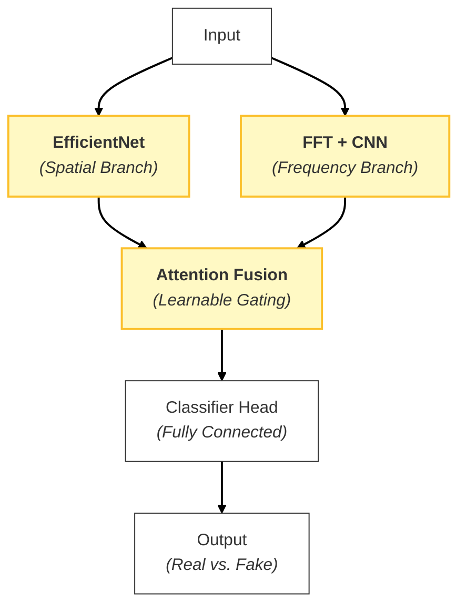
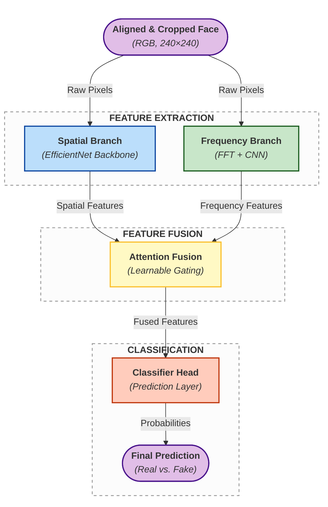
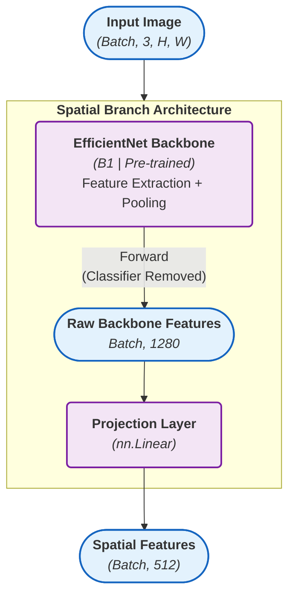
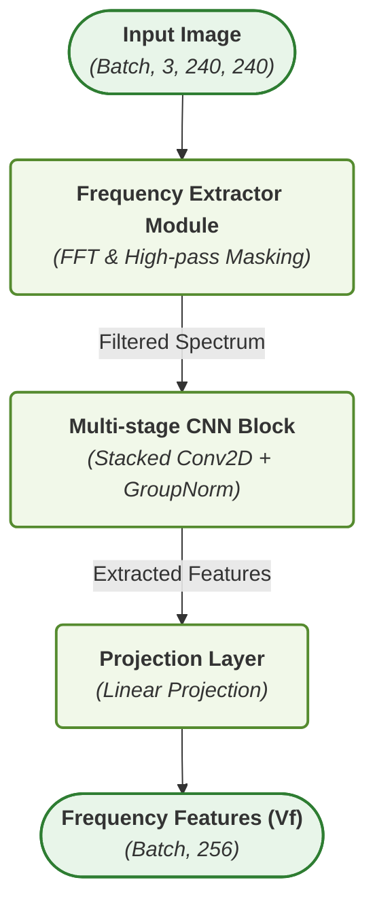
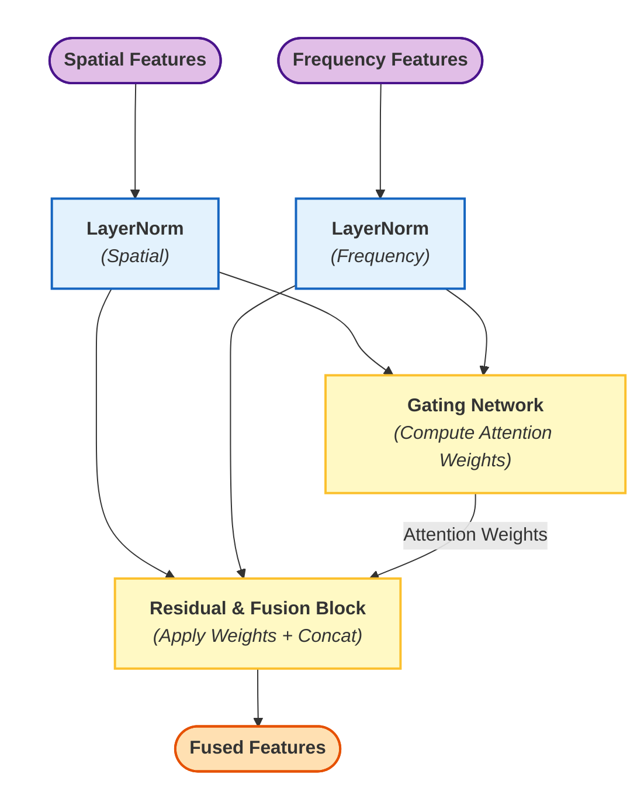
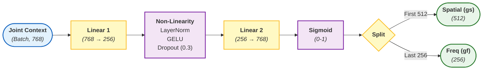
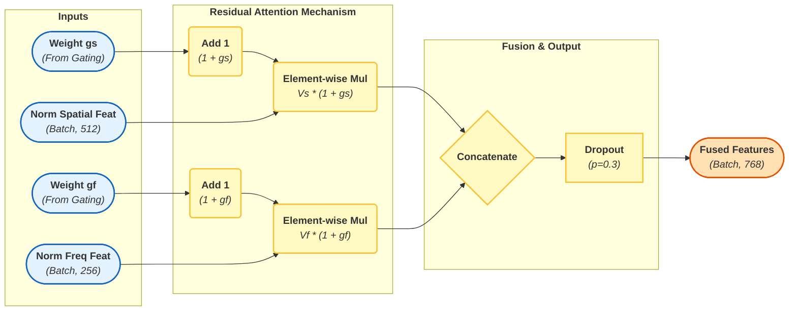
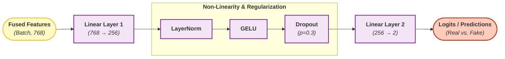

# CÁC SƠ ĐỒ KIẾN TRÚC MÔ HÌNH ĐƯỢC SỬ DỤNG

# Ý tưởng tổng quát

# Kiến trúc tổng quan

# Nhánh đặc trưng không gian (spatial)

# Nhánh đặc trưng tần số

# Attention

## Tổng quan

## Gating Network

## Attention Fusion

# Classification Head

