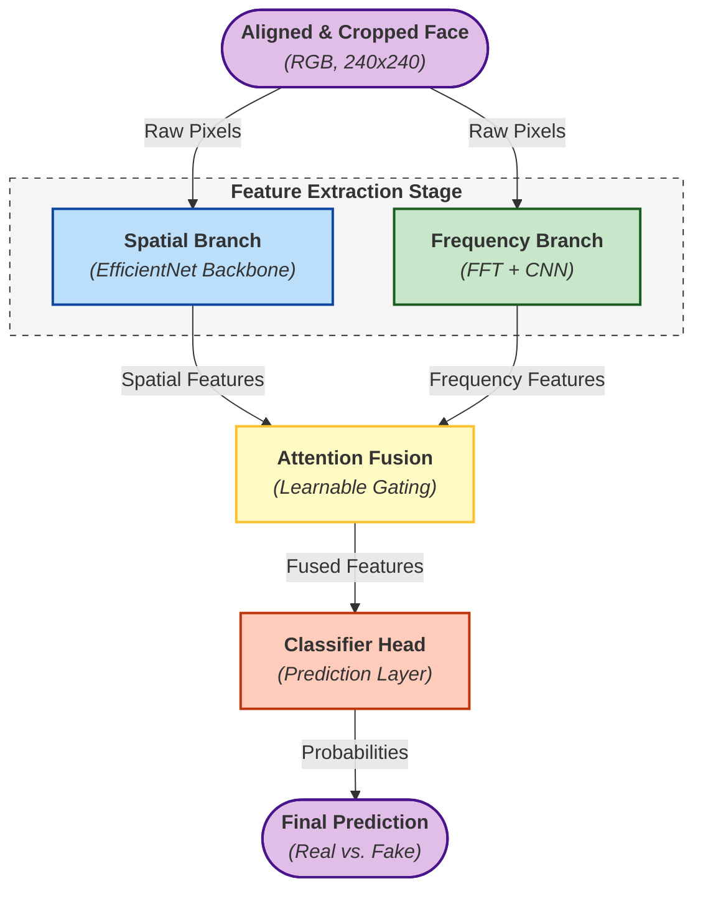
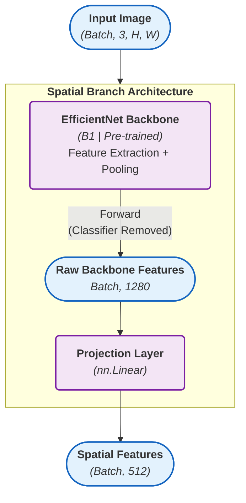
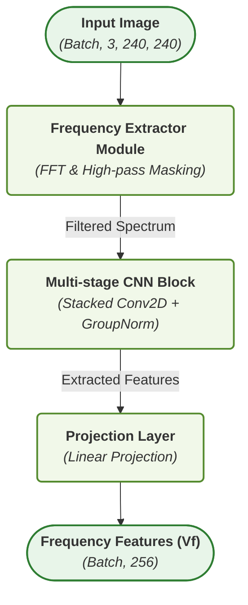
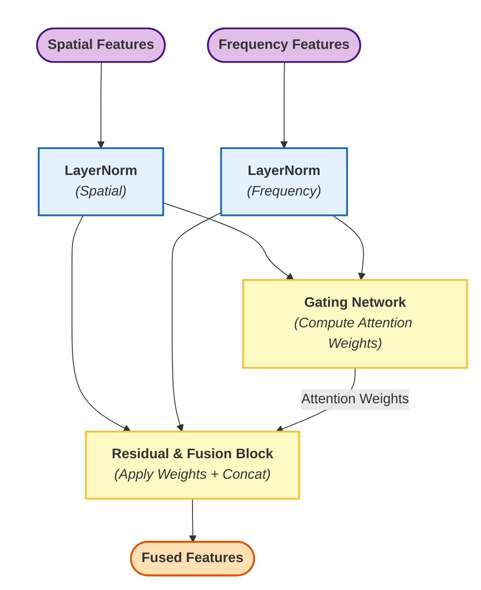
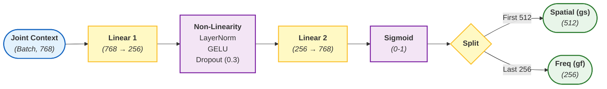
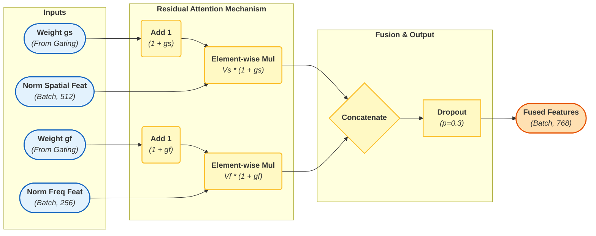
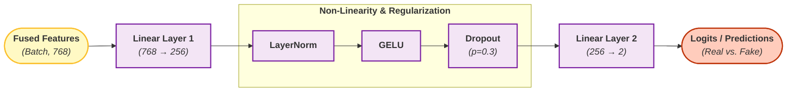

# Sơ đồ tổng quan

```mermaid
---
config:
  layout: dagre
---
flowchart TB
 subgraph FeatureExtraction["<b>Feature Extraction Stage</b>"]
    direction LR
        Spatial["<b>Spatial Branch</b><br><i>(EfficientNet Backbone)</i>"]
        Frequency["<b>Frequency Branch</b><br><i>(FFT + CNN)</i>"]
  end
    Input(["<b>Aligned &amp; Cropped Face</b><br><i>(RGB, 240x240)</i>"]) -- Raw Pixels --> Spatial & Frequency
    Spatial -- Spatial Features --> Fusion["<b>Attention Fusion</b><br><i>(Learnable Gating)</i>"]
    Frequency -- Frequency Features --> Fusion
    Fusion -- Fused Features --> Classifier["<b>Classifier Head</b><br><i>(Prediction Layer)</i>"]
    Classifier -- Probabilities --> Output(["<b>Final Prediction</b><br><i>(Real vs. Fake)</i>"])

    style Spatial fill:#bbdefb,stroke:#0d47a1,stroke-width:2px
    style Frequency fill:#c8e6c9,stroke:#1b5e20,stroke-width:2px
    style Input fill:#e1bee7,stroke:#4a148c,stroke-width:2px
    style Fusion fill:#fff9c4,stroke:#fbc02d,stroke-width:2px
    style Classifier fill:#ffccbc,stroke:#bf360c,stroke-width:2px
    style Output fill:#e1bee7,stroke:#4a148c,stroke-width:2px
    style FeatureExtraction fill:#f5f5f5,stroke:#333,stroke-dasharray: 5 5
```

# Nhánh đặc trưng không gian (spatial)

```mermaid
flowchart TD
 subgraph Spatial_Branch["<b>Spatial Branch Architecture</b>"]
    direction TB
        Backbone["<b>EfficientNet Backbone</b><br><i>(B1 | Pre-trained)</i><br>Feature Extraction + Pooling"]
        RawFeat(["<b>Raw Backbone Features</b><br><i>Batch, 1280</i>"])
        Projection["<b>Projection Layer</b><br><i>(nn.Linear)</i>"]
  end
    Input(["<b>Input Image</b><br><i>(Batch, 3, H, W)</i>"]) --> Spatial_Branch
    Backbone -- Forward <br> (Classifier Removed) --> RawFeat
    RawFeat --> Projection
    Projection --> Output(["<b>Spatial Features</b><br><i>(Batch, 512)</i>"])

     Backbone:::model
     RawFeat:::data
     Projection:::model
     Input:::data
     Output:::data
    classDef data fill:#e3f2fd,stroke:#1565c0,stroke-width:2px,rx:10,ry:10
    classDef model fill:#f3e5f5,stroke:#7b1fa2,stroke-width:2px,rx:5,ry:5
    classDef container fill:#fff,stroke:#333,stroke-dasharray: 5 5
```

# Nhánh đặc trưng tần số

```mermaid
graph TD
    %% Style Definitions
    classDef data fill:#e8f5e9,stroke:#2e7d32,stroke-width:2px,rx:10,ry:10;
    classDef module fill:#f1f8e9,stroke:#558b2f,stroke-width:2px,rx:5,ry:5;

    %% Nodes
    Input(["<b>Input Image</b><br/><i>(Batch, 3, 240, 240)</i>"]):::data

    FreqModule["<b>Frequency Extractor Module</b><br/><i>(FFT & High-pass Masking)</i>"]:::module

    CNN["<b>Multi-stage CNN Block</b><br/><i>(Stacked Conv2D + GroupNorm)</i>"]:::module

    Proj["<b>Projection Layer</b><br/><i>(Linear Projection)</i>"]:::module

    Output(["<b>Frequency Features (Vf)</b><br/><i>(Batch, 256)</i>"]):::data

    %% Flow
    Input --> FreqModule
    FreqModule -->|Filtered Spectrum| CNN
    CNN -->|Extracted Features| Proj
    Proj --> Output
```

# Attention

## Tổng quan

```mermaid
---
config:
  layout: dagre
---
flowchart TB
 subgraph Inputs[" "]
    direction LR
        InS(["<b>Spatial Features</b>"])
        InF(["<b>Frequency Features</b>"])
  end
 subgraph Norms[" "]
    direction LR
        NormS["<b>LayerNorm</b><br><i>(Spatial)</i>"]
        NormF["<b>LayerNorm</b><br><i>(Frequency)</i>"]
  end
    InS --> NormS
    InF --> NormF
    NormS --> Gating["<b>Gating Network</b><br><i>(Compute Attention Weights)</i>"] & Fusion["<b>Residual &amp; Fusion Block</b><br><i>(Apply Weights + Concat)</i>"]
    NormF --> Gating & Fusion
    Gating -- Attention Weights --> Fusion
    Fusion --> Output(["<b>Fused Features</b>"])

     InS:::input
     InF:::input
     NormS:::norm
     NormF:::norm
     Gating:::block
     Fusion:::block
     Output:::out
    classDef input fill:#e1bee7,stroke:#4a148c,stroke-width:2px
    classDef norm fill:#e3f2fd,stroke:#1565c0,stroke-width:2px
    classDef block fill:#fff9c4,stroke:#fbc02d,stroke-width:2px
    classDef out fill:#ffe0b2,stroke:#e65100,stroke-width:2px
    style Inputs fill:none,stroke:none
    style Norms fill:none,stroke:none
```

## Gating Network

```mermaid
flowchart LR
    Input(["<b>Joint Context</b><br><i>(Batch, 768)</i>"]) --> L1["<b>Linear 1</b><br><i>(768 → 256)</i>"]
    L1 --> PostProcess["<b>Non-Linearity</b><br>LayerNorm<br>GELU<br>Dropout (0.3)"]
    PostProcess --> L2["<b>Linear 2</b><br><i>(256 → 768)</i>"]
    L2 --> Sig["<b>Sigmoid</b><br><i>(0-1)</i>"]
    Sig --> Split{"<b>Split</b>"}
    Split -- First 512 --> OutS(["<b>Spatial (gs)</b><br><i>(512)</i>"])
    Split -- Last 256 --> OutF(["<b>Freq (gf)</b><br><i>(256)</i>"])

     Input:::input
     L1:::layer
     PostProcess:::act
     L2:::layer
     Sig:::act
     Split:::layer
     OutS:::output
     OutF:::output
    classDef input fill:#e3f2fd,stroke:#1565c0,stroke-width:2px
    classDef layer fill:#fff9c4,stroke:#fbc02d,stroke-width:2px
    classDef act fill:#f3e5f5,stroke:#7b1fa2,stroke-width:2px
    classDef output fill:#e8f5e9,stroke:#2e7d32,stroke-width:2px
```

## Attention Fusion

```mermaid
flowchart LR
    %% INPUTS
    subgraph Inputs ["<b>Inputs</b>"]
        FeatS(["<b>Norm Spatial Feat</b><br><i>(Batch, 512)</i>"])
        FeatF(["<b>Norm Freq Feat</b><br><i>(Batch, 256)</i>"])

        WeightS(["<b>Weight gs</b><br><i>(From Gating)</i>"])
        WeightF(["<b>Weight gf</b><br><i>(From Gating)</i>"])
    end

    %% RESIDUAL OPERATIONS
    subgraph ResOp ["<b>Residual Attention Mechanism</b>"]
        direction TB
        %% Logic cho Spatial
        AddOneS("<b>Add 1</b><br><i>(1 + gs)</i>")
        MulS("<b>Element-wise Mul</b><br><i>Vs * (1 + gs)</i>")

        %% Logic cho Freq
        AddOneF("<b>Add 1</b><br><i>(1 + gf)</i>")
        MulF("<b>Element-wise Mul</b><br><i>Vf * (1 + gf)</i>")
    end

    %% FUSION OPERATIONS
    subgraph Finalize ["<b>Fusion & Output</b>"]
        Concat{<b>Concatenate</b>}
        Drop["<b>Dropout</b><br><i>(p=0.3)</i>"]
    end

    Out(["<b>Fused Features</b><br><i>(Batch, 768)</i>"])

    %% FLOW CONNECTIONS
    %% Spatial Flow
    WeightS --> AddOneS
    AddOneS --> MulS
    FeatS --> MulS

    %% Freq Flow
    WeightF --> AddOneF
    AddOneF --> MulF
    FeatF --> MulF

    %% Fusion Flow
    MulS --> Concat
    MulF --> Concat
    Concat --> Drop
    Drop --> Out

    %% STYLING
    classDef data fill:#e3f2fd,stroke:#1565c0,stroke-width:2px
    classDef op fill:#fff9c4,stroke:#fbc02d,stroke-width:2px
    classDef final fill:#ffe0b2,stroke:#e65100,stroke-width:2px

    class FeatS,FeatF,WeightS,WeightF data
    class AddOneS,MulS,AddOneF,MulF,Concat,Drop op
    class Out final
```

# Classification Head

```mermaid
---
config:
  layout: dagre
---
flowchart LR
 subgraph Process["<b>Non-Linearity &amp; Regularization</b>"]
        LN["<b>LayerNorm</b>"]
        GELU["<b>GELU</b>"]
        Drop["<b>Dropout</b><br><i>(p=0.3)</i>"]
  end
    Input(["<b>Fused Features</b><br><i>(Batch, 768)</i>"]) --> L1["<b>Linear Layer 1</b><br><i>(768 → 256)</i>"]
    L1 --> LN
    LN --> GELU
    GELU --> Drop
    Drop --> L2["<b>Linear Layer 2</b><br><i>(256 → 2)</i>"]
    L2 --> Output(["<b>Logits / Predictions</b><br><i>(Real vs. Fake)</i>"])

     LN:::layer
     GELU:::layer
     Drop:::layer
     Input:::input
     L1:::layer
     L2:::layer
     Output:::out
    classDef input fill:#fff9c4,stroke:#fbc02d,stroke-width:2px
    classDef layer fill:#f3e5f5,stroke:#7b1fa2,stroke-width:2px
    classDef out fill:#ffccbc,stroke:#bf360c,stroke-width:2px
```
